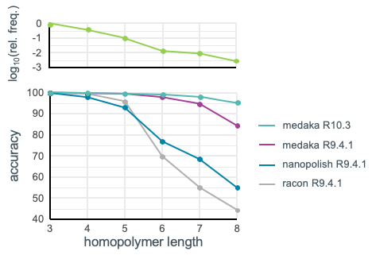
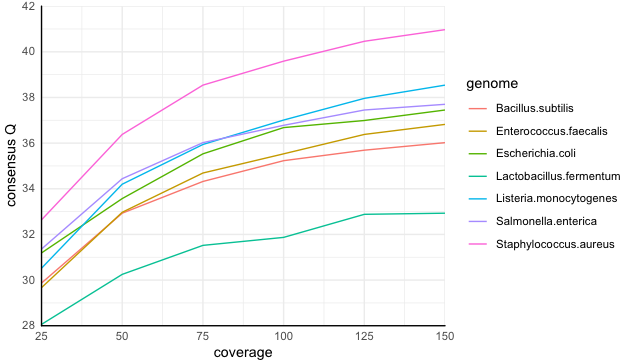

.. _Benchmarks:

Benchmarks
==========

The following demonstrates the utility of Medaka's neural network in forming an
improved consensus from a pileup of reads.

Results were obtained using the default models provided with ``medaka``. These models
were trained using data obtained from E.coli, S.cerevisiae and H.sapiens samples.

Error statistics were calculated using the `pomoxis
<https://github.com/nanoporetech/pomoxis>`_ program ``assess_assembly`` after
aligning 100kb chunks of the consensus to the reference. Reported metrics are
median values over all chunks. 

Comparison of `medaka` and `nanopolish` 
---------------------------------------

In this comparison the ``medaka`` E.coli :doc:`walkthrough` dataset was used.
These data were not used to train the model. Basecalling was performed using
``Guppy v2.2.1``; both the older transducer and the newer flip-flop algorithm
were used for comparison. Basecalled reads were trimmed using `porechop
<https://github.com/rrwick/Porechop>`_ to remove adapters, and assembly was
performed using `canu v1.8 <https://github.com/marbl/canu>`_. The assembly was
corrected using `racon v1.3.1 <https://github.com/isovic/racon>`_ before being passed
to ``medaka`` or ``nanopolish``. `nanopolish v0.10.1
<https://github.com/jts/nanopolish>`_ was run using :code:`--fix-homopolymers` option.

The workflow used here includes four iterations of ``racon``. This should not be viewed as optimal for all
datasets, see :ref:`draftorigin` for further details.

+-----------------+----------------------------------------+----------------------------------------+
|                 | **flipflop**                           | **transducer**                         |
+                 +--------------+----------+--------------+--------------+----------+--------------+
|                 | *racon (x4)* | *medaka* | *nanopolish* | *racon (x4)* | *medaka* | *nanopolish* |
+-----------------+--------------+----------+--------------+--------------+----------+--------------+
| Q(accuracy)     |         26.8 |   34.2   |         32.0 |         25.2 |     31.9 |         31.0 |
+-----------------+--------------+----------+--------------+--------------+----------+--------------+
| Q(substitution) |         45.2 |   50.0   |         47.0 |         41.0 |     47.0 |         41.4 |
+-----------------+--------------+----------+--------------+--------------+----------+--------------+
| Q(deletion)     |         27.1 |   34.0   |         32.6 |         25.6 |     35.0 |         30.7 |
+-----------------+--------------+----------+--------------+--------------+----------+--------------+
| Q(insertion)    |         40.1 |   50.0   |         43.0 |         39.2 |     35.2 |         40.5 |
+-----------------+--------------+----------+--------------+--------------+----------+--------------+
| CPU time / hrs  |        00:50 |  00:07   |        49:10 |        00:50 |    00:07 |        50:24 |
+-----------------+--------------+----------+--------------+--------------+----------+--------------+

For this dataset the older transducer basecaller with ``medaka`` delivers
similar results to ``nanopolish`` in a fraction of the time. The flip-flop
workflow is seen to be superior to nanopolish. The runtime of ``medaka`` can be
reduced further by utilizing a GPU, the runtime with a NVIDIA GTX1080Ti is
found to be less than one minute!

A particular advantage of ``medaka`` over other methods is its improved
accuracy in recovering homopolymer lengths.

Above the main plot we show homopolymer frequencies from H.sapiens Chrom. 1,
adapted from `Statistical analysis of simple repeats in the human genome <http://dirac.cnrs-orleans.fr/~piazza/PB/files/DNA.pdf>`_.

Evaluation across samples and depths
------------------------------------

The comparison below illustrates results at various coverage depths for a
collection of further organisms. Assemblies were performed as above with
canu and racon, using the ``Guppy v3.0.3`` high accuracy basecaller and
``medaka v0.6.5``.

