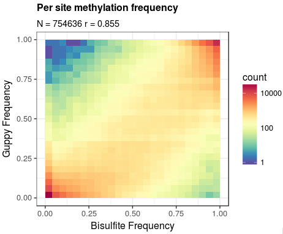

Methylation calling
===================

Medaka includes a basic workflow for aggregating Guppy basecalling results
for Dcm, Dam, and CpG methylation. The workflow is currently very preliminary
and subject to change and improvement.

Aggregating the information from Guppy outputs is a two stage process, first
the basecalling results are extracted `.fast5` files and placed in a `.bam`
file:

.. code-block:: bash

    FAST5PATH=guppy/workspace
    REFERENCE=grch38.fasta
    OUTBAM=meth.bam
    medaka methylation guppy2sam ${FAST5PATH} ${REFERENCE} \
        --workers 16 --io_workers 4 --recursive \
        | samtools sort -@ 8 | samtools view -b -@ 8 > ${OUTBAM}
    samtools index ${OUTBAM}

This program will extract both the basecall sequence and methylation scores,
align the basecall to the reference, and store results in a standard format.
In this preliminary workflow the methylation scores are stored in two SAM
tags, 'MC' and 'MA', one each for 5mC and 6mA respectively. The tags are
8bit integer array-values, one value per basecall position. This is a
different form to that proposed in the current
`hts-specs proposition <https://github.com/samtools/hts-specs/pull/418/files>`_,
but allows for more trivial parsing.

The second step is to aggregate the reference-aligned information to produce
a simple tabular summary of read methylation counts:

.. code-block:: bash

    BAM=meth.bam
    REFERENCE=grch38.fasta
    REGION=chr20:500000-1000000
    OUTPUT=meth.tsv
    medaka methylation call --meth cpg ${BAM} ${REFERENCE} ${REGION} ${OUTPUT}

Here the option ``--meth cpg`` indicates that loci containing the sequence
motif ``CG`` should be examined for 5mC presence. Other choices are
``dcm`` (motifs ``CCAGG`` and ``CCTGG``) for 5mC and ``dam`` (``GATC``) for 6mA.

The output file is a simple tab-delimited text file with columns:
'ref.name', 'position', 'motif', 'fwd.meth.count', 'rev.meth.count',
'fwd.canon.count', and 'rev.canon.count'. Here fwd./rev. indicate counts on the
two DNA strands and meth./canon. indicate counts for methylated and
canonical bases. Note that the position field records the position of the
first base in the motif recorded.

As a first demonstration of this method the plot below shows a comparison with
bisulphite sequencing `results <https://www.encodeproject.org/files/ENCFF835NTC/>`_
for chromosome 20 of the NA12878 sample.

Reasonable correlation is found, especially given the simplicity of the aggregation
method. A slight bias toward lower methylation frequency is observed through the range,
except at very low frequencies where the method has a bias upward.
